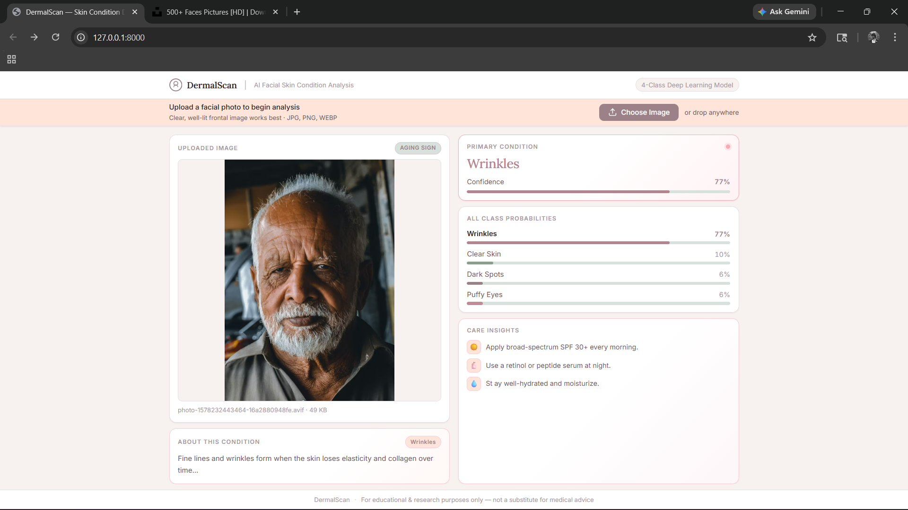

# 🌐 Skin Condition Classification Web Application

## 📌 Overview

This project is a full-stack machine learning web application project. The system performs image classification on skin images and predicts one of four skin conditions using a deep learning model.

The application provides real-time predictions along with confidence scores, making the results interpretable, transparent, and user-friendly.

---

## Objective

The main objective of this project is to design and implement an end-to-end deployable machine learning system that:

- Classifies skin images into predefined categories  
- Provides prediction confidence scores  
- Offers an interactive web interface for users  
- Demonstrates real-world deployment of a deep learning model using modern web technologies  

---

## Classes Predicted

- Clear Skin  
- Dark Spots  
- Puffy Eyes  
- Wrinkles  

---

## Dataset Description

- Total images: ~1200  
- Type: Labeled image dataset  
- Number of classes: 4  
- Preprocessing techniques: resizing, normalization, augmentation  

---

# Model Development & Experimentation

During development, two different pipeline strategies were tested using the **same EfficientNetB0 architecture**, but with different preprocessing approaches.

---

## 1. Haar Cascade + EfficientNetB0 (Hybrid Pipeline)

In this approach, a Haar Cascade face/region detection stage was added before classification.

### Pipeline Flow
Face Detection → Cropping → EfficientNetB0 → Prediction

### ⚠️ Limitations
- Failed on non-frontal / unclear images  
- Sensitive to lighting conditions  
- Detection failure caused prediction failure  
- Increased pipeline complexity  
- Reduced robustness in real-world scenarios  

---

## 2. Direct EfficientNetB0 Pipeline (Final Model)

Final system uses EfficientNetB0 directly on images without Haar Cascade.

### Pipeline Flow
Image → Preprocessing → EfficientNetB0 → Prediction

### ✅ Advantages
- More stable predictions  
- Better generalization  
- Faster inference  
- No dependency on detection stage  
- Improved real-world performance  

---

## Model Performance Comparison

### Haar Cascade + EfficientNetB0

---

### Final EfficientNetB0 Model

---

## Confusion Matrix (Final Model)

---

## Dataset Distribution (Bar Plot)

---

# System Architecture

## 1. Frontend
- HTML, CSS, JavaScript  
- Handles image upload and UI rendering  
- Displays prediction results  

## 2. Backend
- FastAPI server  
- Handles image processing and inference  
- Returns JSON response  

## 3. Machine Learning Model
- EfficientNetB0 CNN  
- Loaded at runtime  
- Performs classification  

---

# Workflow

1. User uploads image  
2. Frontend sends image to backend  
3. Image is preprocessed  
4. EfficientNetB0 performs inference  
5. Probabilities are generated  
6. Highest class selected  
7. Result sent to frontend  
8. UI displays prediction  

---

# Backend (FastAPI)

## main.py

Handles API requests and prediction pipeline.

### Routes:
- `/` → Loads frontend UI  
- `/predict` → Handles image upload & returns prediction  

---

## model.py

- Loads EfficientNetB0 trained model  
- Provides model instance for inference  

---

## preprocess.py

- Resizes images  
- Normalizes pixel values  
- Converts image to tensor format  

---

# Frontend (JavaScript)

## script.js

Handles UI + backend communication.

### Functions:

- `run(file)`  
  - Sends image to backend  
  - Receives prediction  

- `render(preds)`  
  - Displays results  
  - Shows confidence bars  
  - Updates UI dynamically  

- Drag & Drop support  
  - Smooth image upload experience  

---

# Results and Evaluation

The system outputs:

- Predicted Class  
- Confidence Score  
- Probability Distribution  

---

## Sample Predictions

The following table shows example outputs generated by the model during testing.

| Input Image | Predicted Class | Confidence (%) | Clear Skin | Dark Spots | Puffy Eyes | Wrinkles |
|-------------|-----------------|----------------|------------|------------|------------|----------|
| Image 1     | Dark Spots      | 72.00          | 14.00      | 72.00      | 10.00      | 03.00    |
| Image 2     | Clear Skin      | 64.00          | 64.00      | 22.00      | 11.00      | 03.00    |
| Image 3     | Wrinkles        | 77.00          | 10.00      | 06.00      | 06.00      | 77.00    |
| Image 4     | Puffy Eyes      | 61.00          | 14.00      | 02.00      | 61.00      | 22.00    |

---

## Sample Outputs

## 📌 Input Image 1

**Prediction:** Dark Spots  
**Confidence:** 72.00%

---

## 📌 Input Image 2

**Prediction:** Clear Skin 
**Confidence:** 64.00%

---

## 📌 Input Image 3

**Prediction:** Wrinkles   
**Confidence:** 77.00%

---

## 📌 Input Image 4

**Prediction:** Puffy Eyes
**Confidence:** 61.00%

---

# Observation Summary

- EfficientNetB0 provides stable predictions  
- Direct pipeline performs better than hybrid  
- Confidence scores are reliable  
- UI visualizations improve interpretability  

---

# Final Conclusion

The final deployed system uses a **direct EfficientNetB0 pipeline**, which outperforms the Haar Cascade integrated approach in both stability and accuracy. The system successfully demonstrates real-time image classification with an interactive web interface.

---

# License

This project is licensed under the **MIT License**.

You are free to use, modify, and distribute this project for personal, academic, or commercial purposes with proper attribution.

The project is provided "as is", without any warranty.

---

# Credits

Developed as part of an academic internship project.

Built using:
- EfficientNetB0 (TensorFlow / Keras)
- FastAPI
- HTML, CSS, JavaScript
- NumPy, OpenCV

Special thanks to the open-source ML and web development community for tools and documentation.

---