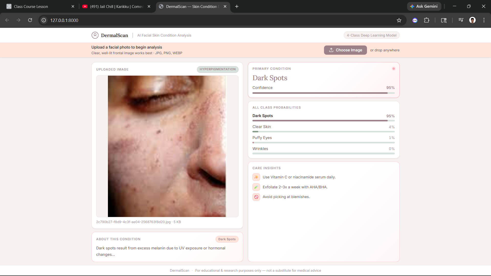
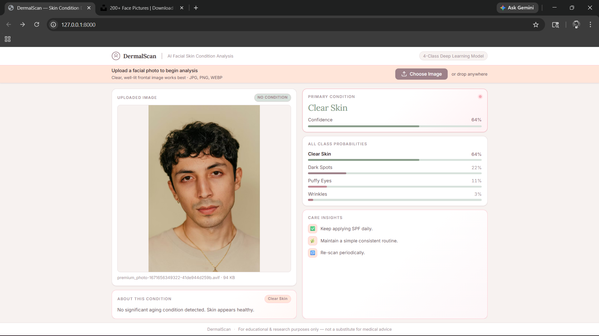

# 🌐 Skin Condition Classification Web Application

## 📌 Overview

This project is a full-stack machine learning web application developed as part of an academic internship project. The system performs image classification on skin images and predicts one of four skin conditions using a deep learning model.

The application provides real-time predictions along with confidence scores, making the results interpretable, transparent, and user-friendly.

---

## 🎯 Objective

The main objective of this project is to design and implement an end-to-end deployable machine learning system that:

- Classifies skin images into predefined categories  
- Provides prediction confidence scores  
- Offers an interactive web interface for users  
- Demonstrates real-world deployment of a deep learning model using modern web technologies  

---

## 🏷️ Classes Predicted

The model classifies input images into the following four categories:

- Clear Skin  
- Dark Spots  
- Puffy Eyes  
- Wrinkles  

---

## 📊 Dataset Description

- Total images: ~1200  
- Type: Labeled image dataset  
- Number of classes: 4  
- Preprocessing techniques: resizing, normalization, and augmentation  

---

## 🧠 Machine Learning Model

- Architecture: EfficientNetB0  
- Type: Transfer Learning Convolutional Neural Network (CNN)  
- Framework: TensorFlow / Keras  
- Output:
  - Predicted class label  
  - Confidence score  
  - Probability distribution across all classes  

---

## 🏗️ System Architecture

The system consists of three main components:

### 1. Frontend
- Built using HTML, CSS, and JavaScript  
- Handles user interaction and image upload  
- Displays prediction results and visualization  

### 2. Backend
- Built using FastAPI  
- Handles image upload, preprocessing, and inference  
- Returns prediction results as JSON response  

### 3. Machine Learning Model
- Trained EfficientNetB0 model  
- Loaded during runtime for inference  
- Performs classification on preprocessed images  

---

## 🔄 Workflow

1. User uploads an image through the web interface  
2. Frontend sends the image to the backend API  
3. Backend preprocesses the image  
4. Model performs inference on the image  
5. Class probabilities are computed  
6. Highest probability class is selected as prediction  
7. Result and confidence score are sent back to frontend  
8. UI displays prediction with visual indicators  

---

## ⚡ Key Features

- Real-time image classification  
- Confidence score visualization  
- Probability distribution display  
- Interactive drag-and-drop UI  
- Lightweight and fast inference system  

# 🧩 Important Files & Functions Explanation

This section explains the role of each core file in the system and the important functions used in both backend (Python) and frontend (JavaScript). The project follows a full-stack architecture where the backend handles model inference and the frontend manages user interaction and visualization.

---

# 🐍 1. Backend (FastAPI - Python)

---

## 📄 main.py (Core Backend Server)

### 🎯 Purpose
This is the main backend file that connects the frontend with the machine learning model. It handles API requests, processes uploaded images, and returns predictions.

---

### 🔑 Key Components & Functions

## 🌐 FastAPI App Initialization
Creates the FastAPI application instance:
- Used to define API routes
- Handles request-response cycle

---

## 📌 `/` Route (index function)

### Function:
- Serves the frontend homepage (`index.html`)

### Working:
- When user opens the web app, this route loads the UI
- Uses `FileResponse` to return HTML file

---

## 📌 `/predict` Route (Main Inference Function)

### Function:
Handles image prediction request from frontend

### Workflow:

1. **Receives image file**
   - Uploaded via `UploadFile`

2. **Saves image temporarily**
   - Stores in `uploads/` directory

3. **Preprocesses image**
   - Calls `preprocess_image()` from `preprocess.py`

4. **Model Prediction**
   - Passes processed image to `model.predict()`

5. **Extracts results**
   - Uses `np.argmax()` to find highest probability class
   - Calculates confidence score

6. **Returns JSON response**
   - Predicted class
   - Confidence score
   - All class probabilities

---

### 📤 Output Format:
- class → predicted label  
- confidence → probability percentage  
- all_probs → full probability distribution  

---

## ⚡ Role Summary of main.py
- Acts as API bridge between frontend and ML model  
- Handles file upload and response generation  
- Controls entire prediction pipeline  

---

---

## 📄 model.py (Machine Learning Model Loader)

### 🎯 Purpose
This file is responsible for loading the trained EfficientNetB0 model and making it available for inference.

---

### 🔑 Key Functionality

- Loads pre-trained model (EfficientNetB0-based CNN)
- Model is saved in `.h5` or SavedModel format
- Used during runtime for prediction

---

### ⚡ Responsibilities

- Initializes trained neural network
- Ensures model is loaded only once (efficient inference)
- Provides model object to `main.py`

---

### ⚡ Role Summary of model.py
- Acts as the ML brain of the system  
- Provides prediction capability to backend  

---

---

## 📄 preprocess.py (Image Processing Module)

### 🎯 Purpose
Prepares input images so they match the format required by the deep learning model.

---

### 🔑 Function: `preprocess_image(path)`

### Steps:

1. **Load Image**
   - Reads image from file path

2. **Resize Image**
   - Converts image to required input size (e.g., 224x224)

3. **Normalize Pixel Values**
   - Scales values between 0 and 1

4. **Expand Dimensions**
   - Converts shape to batch format `(1, H, W, C)`

---

### 📤 Output:
- Preprocessed NumPy array ready for model inference

---

### ⚡ Role Summary of preprocess.py
- Ensures input data is compatible with EfficientNetB0  
- Standardizes image format before prediction  

---

---

# 🌐 2. Frontend (JavaScript - script.js)

---

## 📄 script.js (Main Frontend Logic)

### 🎯 Purpose
Handles all user interactions, API communication, and dynamic UI updates.

---

## 🔑 Key Functions

---

## 📌 `run(file)` (Main Pipeline Function)

### Workflow:

1. **Image Preview**
   - Displays uploaded image using `URL.createObjectURL()`

2. **API Request**
   - Sends image to backend `/predict` using `fetch`

3. **Receives Response**
   - Gets predicted class + confidence + probabilities

4. **Processes Data**
   - Maps backend probabilities to frontend class structure

5. **Calls Render Function**
   - Sends processed data to UI renderer

---

### ⚡ Role:
- Acts as main controller for prediction flow

---

## 📌 `render(preds, file)` (UI Rendering Function)

### Responsibilities:

- Displays predicted class
- Shows confidence percentage
- Updates progress bar dynamically
- Builds probability bar chart
- Displays condition description
- Loads recommendation tips

---

### UI Updates:

- 🏷️ Prediction badge
- 📊 Confidence bar
- 📈 Probability distribution chart
- 💡 Skin care tips section

---

## 📌 Drag & Drop Handlers

### Functions:
- `dragover`
- `dragleave`
- `drop`

### Purpose:
- Allows users to upload images by dragging files
- Improves UX experience

---

## 📌 File Input Handler

- Triggered when user selects file manually
- Calls `run(file)` automatically

---

## ⚡ Role Summary of script.js
- Controls entire frontend logic  
- Connects UI with backend API  
- Dynamically updates visualization  

---

# 🧠 FINAL SUMMARY (FOR VIVA)

This system is divided into:
- Backend (FastAPI) → handles ML inference  
- ML Layer → EfficientNetB0 model  
- Preprocessing Layer → image normalization  
- Frontend → UI + visualization + API communication  

Together, they form a complete real-time image classification system.

---

# 📊 Results and Evaluation

This section presents the results obtained from the trained skin condition classification model. The system performs real-time predictions on uploaded images and displays the predicted class along with confidence scores and probability distribution.

---

## 🧪 Output Format

For each input image, the system generates:

- Predicted Class  
- Confidence Score (%)  
- Probability Distribution across all 4 classes  

---

## 📋 Sample Prediction Results

The following table shows example outputs generated by the model during testing.

| Input Image | Predicted Class | Confidence (%) | Clear Skin | Dark Spots | Puffy Eyes | Wrinkles |
|-------------|-----------------|----------------|------------|------------|------------|----------|
| Image 1     | Dark Spots      | 95.00          | 04.00      | 95.00      | 01.00      | 00.00    |
| Image 2     | Clear Skin      | 64.00          | 64.00      | 22.00      | 11.00      | 03.00    |
| Image 3     | Wrinkles        | 77.00          | 10.00      | 06.00      | 06.00      | 77.00    |
| Image 4     | Puffy Eyes      | 61.00          | 14.00      | 02.00      | 61.00      | 22.00    |

---

# 🖼️ Sample Output Visualizations

## 📌 Input Image 1

**Prediction:** Dark Spots  
**Confidence:** 95.00%

---

## 📌 Input Image 2

**Prediction:** Clear Skin 
**Confidence:** 64.00%

---

## 📌 Input Image 3

**Prediction:** Wrinkles   
**Confidence:** 77.00%

---

## 📌 Input Image 4

**Prediction:** Puffy Eyes
**Confidence:** 61.00%

---

# 📈 Observation Summary

- The model produces consistent predictions across different test images  
- Confidence scores are generally high for correct classifications  
- Softmax probability distribution ensures interpretability of outputs  
- The web interface effectively visualizes predictions in real time  
